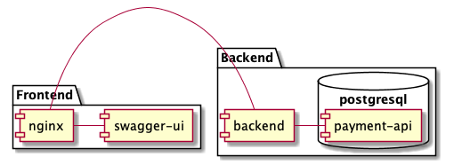

# Payment API

## Design document

This is the design document for Magnus Coding Exercise.

## Table of contents

* [Introduction](#chapter-introduction)
* [Components](#chapter-components)
* [Swagger](#chapter-swagger)
* [Backend](#chapter-backend)
* [Operations](#chapter-operations)
* [Deployment](#chapter-deployment)

## Introduction <a name="chapter-introduction"></a>

The API is implemented in go running in a stack of docker containers. 

## Components <a name="chapter-components"></a>

A description of the components in the system



| Component | Description |
| ---------- | -------------|
| nginx | Web frontend calling swagger-ui for /api requests and calling backend for /api/v1 requests |
| swagger-ui | Swagger UI that shows the different operations and ability to examine the API |
| backend | Backend logic implemented in go |
| payment-api | PostgreSQL database that stores all payments and other information |

## Backend <a name="chapter-backend"></a>

The backend is implemented in go. Dependecies are managed through go modules. 

List of dependecies:

| Dependecy | Usage |
| --------- | -----------------------------------------|
| https://github.com/rs/zerolog | Logging framework |
| https://github.com/jinzhu/gorm | ORM framework |
| https://github.com/go-playground/validator | Validation of structs |
| https://github.com/gin-gonic/gin | HTTP Routing framework |
| https://github.com/google/uuid | UUID generator |
| https://github.com/smartystreets/goconvey | BDD testing framework |

## Swagger

The swagger UI can be reached at http://localhost/api

It shows all endpoints, with input and output data. The endpoints can also be examined from the UI.


## Authentication <a name="chapter-authentication"></a>

Since authentication is out of scope none has been implemented. But the system is simulating that a token of some sort is passed to the API from which an OrganisationID is extracted.  

## Operations <a name="chapter-operations"></a>

Each operation is described using a sequence diagram showing which steps that are taken for each type of operation.

### List payments

A HTTP GET request for listing all payments. This operation will return a full list of all payments for the clients specific organisation.
Example URL: ```http://localhost/api/v1/payments```


### Find payment

A HTTP GET request for a specific payment. This operation will return one payment for supplied ID.
Example URL: ```http://localhost/api/v1/payments/216d4da9-e59a-4cc6-8df3-3da6e7580b77```


### Create payment
A HTTP POST request to create a new payment. This operation will return the ID of the created payment.
Example URL: ```http://localhost/api/v1/payments```


### Update payment

A HTTP PUT request to update a payment. This operation will return the ID of the updated payment.
Example URL: ```http://localhost/api/v1/payments/216d4da9-e59a-4cc6-8df3-3da6e7580b77```


### Delete payment

A HTTP DELETE request to delete a payment. This operation will return the ID of the deleted payment.
Example URL: ```http://localhost/api/v1/payments/216d4da9-e59a-4cc6-8df3-3da6e7580b77```


## Deployment <a name="chapter-deployment"></a>

### Docker images

The following docker images is used for the different components

| Component | Docker image |
| ---------- | -----| 
| nginx | nginx:1.14.2 |
| swagger-ui | swaggerapi/swagger-ui:v3.21.0 |
| backend | scratch |
| payment-api | postgres:10.7 |

### Diagram


